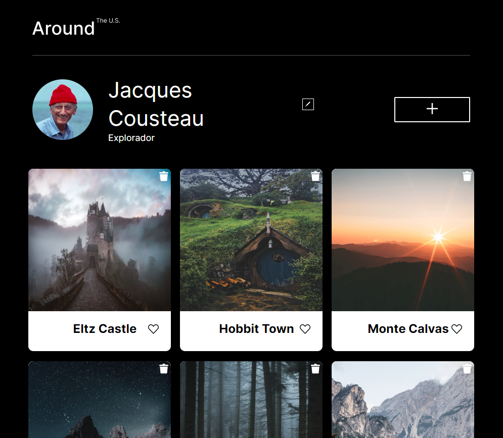

# Proyecto 15: Alrededor de los Estados Unidos React

---

---

### Visita la página >>

https://DeVbrarum.github.io/web_project_around_auth

---

### Descripción general

**Introducción**

Este es un proyecto que experimenta con la interactividad de javascript simulando una red social de imagenes, donde puedes editar el nombre de perfil, añadir nuevos posts, dar like o eliminar los posts.

### Actualizaciones

- Estructura BEM :ok_hand:
- Uso de reglas-at @import
- Aplicación de responsividad
- Implementacion de Javascript
- Validacion formularios
- Uso de Webpack
- Interacción API
- Create React App

---

### Tecnologias Usadas

- HTML
- CSS
- Visual Studio
- Figma
- javascript
- Nodejs
- Webpack
- Webpack-cli
- Webpack-dev-server
- React App

---

## Available Script

In the project directory, you can run:

### `npm start`

Runs the app in the development mode.\
Open [http://localhost:3000](http://localhost:3000) to view it in your browser.

The page will reload when you make changes.\
You may also see any lint errors in the console.
